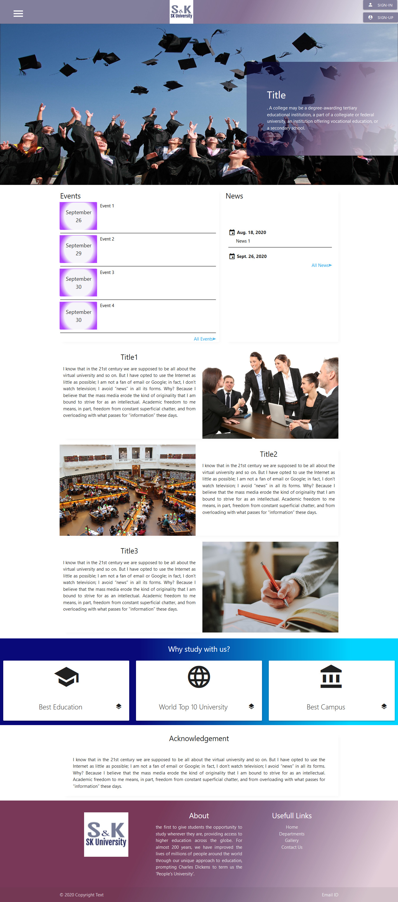

<h2>Project Overview</h2>

<h2>ENVIRONMENT</h2>
<b>Core Language</b>: - Python, Open CV  
<b>Frontend</b>: -Visual Studio Code, Django FrameWork, Materialize CSS  
<b>Backend</b>: - MySQL 
<b>Application Server</b>: - Django server 
